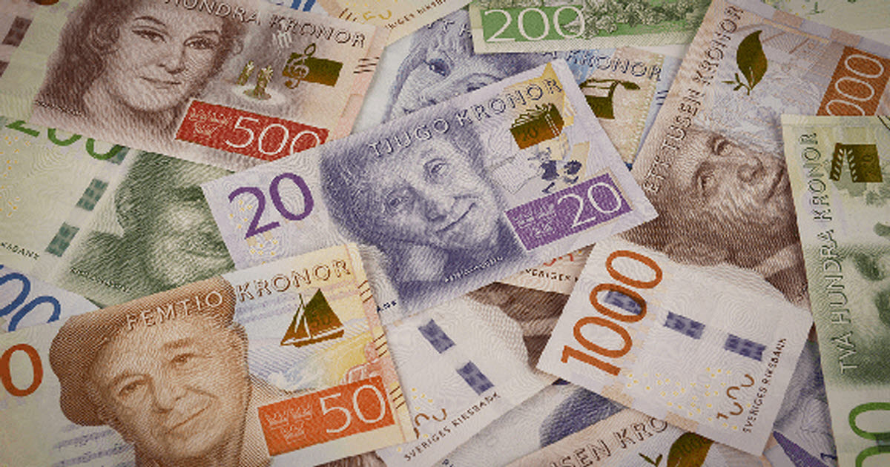
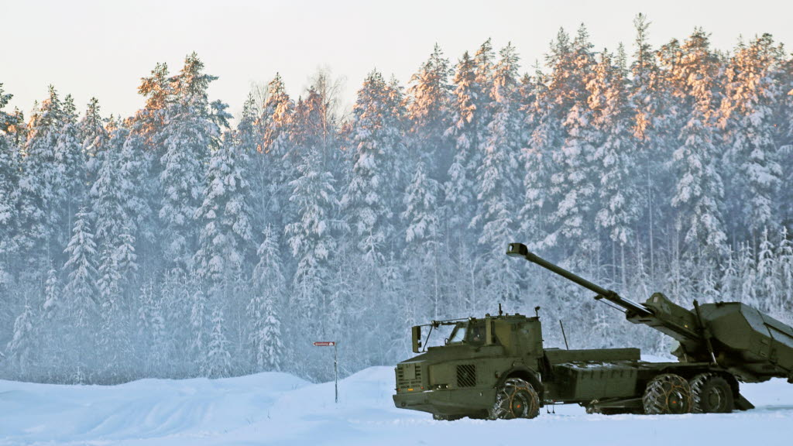

# Nyårsquiz 2023 - Frågor

1. Ett av årets nya ord är `korankris`. En av personerna som stått för bränder är den Irakiske mannen Salwan Momika. En annan person som bränt koranen är den Dansk-Svenske ordförande för det Danska partiet Stram Kurs. Vad heter han?

2. Ekonomin har varit tuff i Sverige under året. Riksbanken har höjt styrräntan vid flera tillfällen. Inflationen har vid tillfällen varit tvåsiffrig. Vad är riksbankens mål för inflation, uttryckt i procent (heltal).

3. Kriget i Ukariana har pågått under året och i hög utsträckning har inte frontlinjerna förskjutits, trots en stor tilltro till att Ukraina skulle kunna trycka tillbaka Ryssland. Sverige har bidragit genom att skicka tunga avancerade vapen till Ukraina. Sverige har nu skickat ett artillerisystem som stått högst upp på Ukarainas önskelista. Vad heter systemet?
   a. Haubits
   b. Pegasus
   c. Archer

4. Under sommaren uppstår protester i en paramilitär rysktrogen organisation som krigar i Ukraina. Ledaren Jevgenij Prigozjin tågar med 25 000 man in i Ryssland med sikte på Moskva. Kuppen avbryts och Prigozjin avrättas efter en månad genom att ett flygplan sprängs upp som han åker med. Vad heter den paramilitära gruppen?

5. Finalnd blir officiellt medlem i Nato den 4:e april 2023. Vad står förkortningen NATO för?

6. En konflikt i toppskicktet av det kriminella nätverket Foxtrot har lett till eskalering av gängvåldet, där även människor utanför gängmiljön blivit drabbade. Vad har den kriminella gängledaren Rawa Majid för smeknamn?

7. I Sudan har inbördeskrig brutit ut mellan två militära grenar inom armén. Omkring 9 000 människor har dödats och 12 000 skadats. Flera miljoner människor är på flykt. Vad heter Sudans huvudstad där mycket av konflikterna ägt rum?
   a. Juba
   b. Karthoum
   c. Kampala
8. Två svenska fotbollssupportrar skjuts i ett terrorarentat riktat mot Sverige. Personen anses vara en ensam gärningsman, men Islamiska Staten tar på sig dådet. I vilken stad skedde terrordådet?

9. Den 7 oktober begår terrorgruppen Hamas ett storskaligt terrorangrepp mot Israel. Omkring 12 000 personer dör och ett hundratal tas som gisslan. Vad heter den politiske ledare för Hamas i Gaza som styrt sedan 2017.
   a. Yahya Sinwar
   b. Abu Bakr Al Bagdadi
   c. Ismail Haniya
10. Vad heter Israels armé som nu har invaderat Gazaremsan?
11. Innan Terroratentatet var Israels preimärminister impopulär, och han har fått stor kritik för att denna typ av attack kunde ske. Vad heter Israels premiärminister?
12. På väg ner för att titta på Titanics vrak imploderar undervattensfarkost som styrs med en tv-spels-kontroller. En Pakistansk affärsman och hans 19-årige son samt en av medgrundarna till företaget förekommer i olyckan. Vad hette undervattensfarkosten?
    a. Voyager
    b. OceanGate
    c. Titan
13. En olycka sker i Gröna Lunds äldsta nuvarande berg- och dalbana. En person omkommer och flera skadas. Vad heter berg- och dalbanan?
14. En person som gått bort under året är skådespelaren Matthew Perry, han blev känd för sin medverkan i tv-serien vänner. Vad hette hans karraktär (förnamn räcker)?
